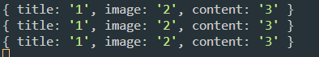

# 게시판 연습

- npm init
- npm i express
- npm i nodemon
- npm i cors

```
{
  "name": "server",
  "version": "1.0.0",
  "description": "",
  "main": "app.js",
  "type": "module",
  "scripts": {
    "test": "echo \"Error: no test specified\" && exit 1",
    "start": "app.js"
  },
  "author": "",
  "license": "ISC",
  "dependencies": {
    "express": "^4.18.2"
  }
}
```

- "type": "module", "start": "app.js"
- 모듈타입과 start경로 추가

```
import express, { urlencoded } from "express";
import listRouter from "./Router/listRouter.js";
import cors from "cors";
const app = express();

app.use(urlencoded({ extended: true }));
app.use(express.json());
app.use(cors());
app.use("/list", listRouter);
app.listen(5959, () => {
  console.log(`http://localhost:5959 실행중~`);
});
```

인코딩작업과 라우터 만들기

```
import express from "express";
import { insert } from "../Controller/listController.js";

const router = express.Router();

router.post("/", insert);
export default router;
```

```
export async function insert(req, res) {
  console.log(req.body);

}
```

body를 통해 넘어오는 데이터 확인

